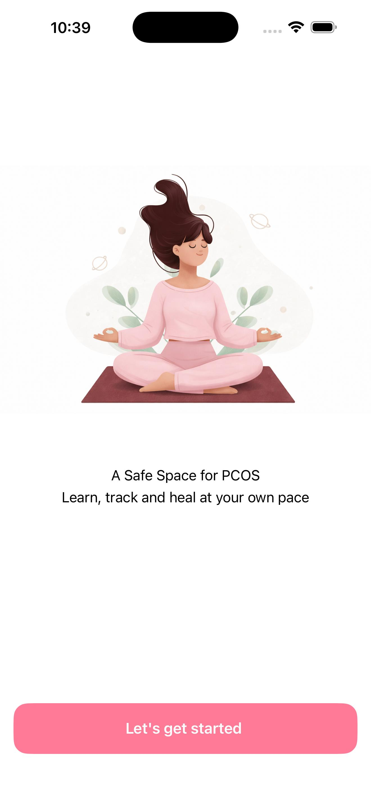
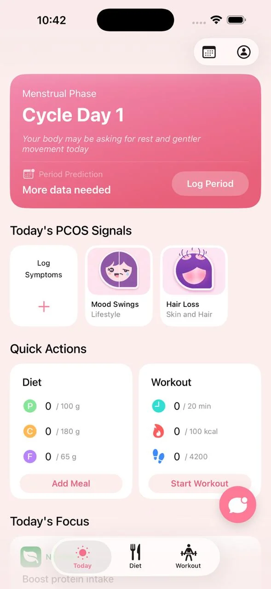
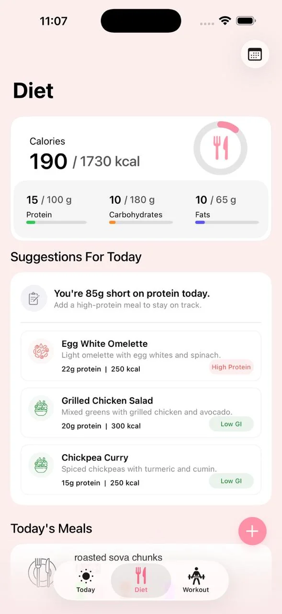
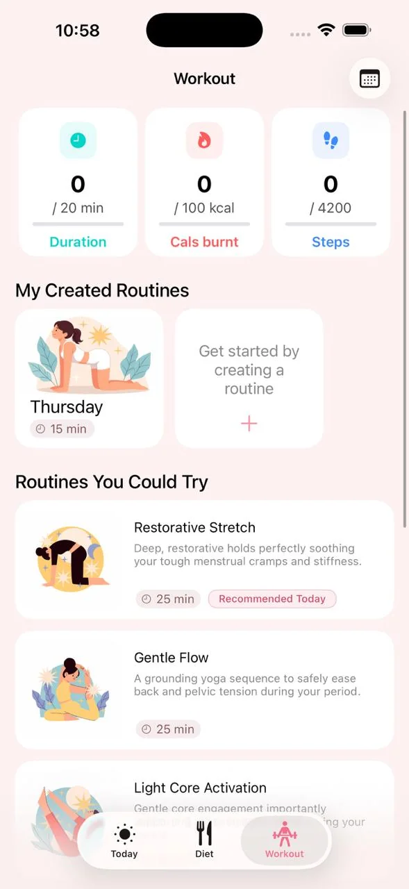

# Cyster - Your PCOS Companion

**An AI-powered health companion for women managing PCOS, built with Indian lifestyle in mind.**

     

&nbsp;
&nbsp;

---

## Try on TestFlight

**[Join the beta →](https://testflight.apple.com/join/5gXW68Jn)**
_Open on your iPhone. Requires iOS 17 or later._

---

## Features

### Today
Your daily health dashboard. Log symptoms, track your menstrual cycle, view your current cycle phase, and get AI-generated daily goals — all in one scrollable view.

### AI Health Coach
A conversational PCOS coach powered by Apple's on-device AI (iOS 18+) with a cloud fallback. It knows your cycle phase, sleep, nutrition, and symptoms — and gives advice tuned specifically for Indian women.

### Diet
Log meals by searching, scanning food with your camera (CoreML), or scanning barcodes. Get AI-suggested PCOS-friendly meal ideas and track macros with visual charts.

### Workout
Browse PCOS-specific predefined routines or build your own. Start a guided workout session with a built-in timer, rest intervals, and a Live Activity on your Lock Screen.

### Sleep
Log your bedtime and wake time daily. View weekly sleep trends and quality scores synced with Apple Health.

### Reminders
Set custom push notification schedules for meals, workouts, and sleep wind-down — configurable to your routine.

### Insights
View cycle history, symptom trends across cycles, nutrition charts, and workout metrics over time.

### Onboarding
A one-time setup that captures your PCOS phenotype, diet preference, and activity level to personalise every AI interaction from day one.

---

## Tech

Swift · UIKit · Core Data · HealthKit · CoreML · FoundationModels · TipKit · ActivityKit

---

## Team

MIT-WPU Group 2 — iOS Development Project
