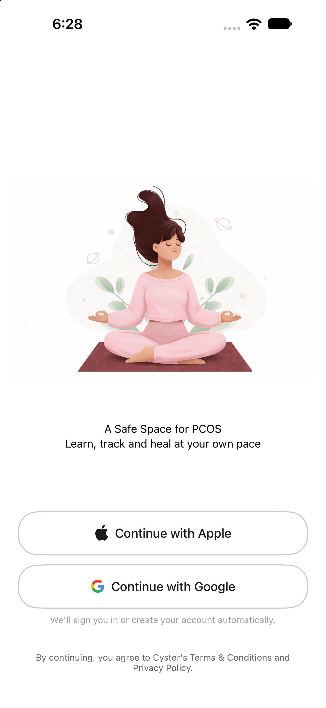
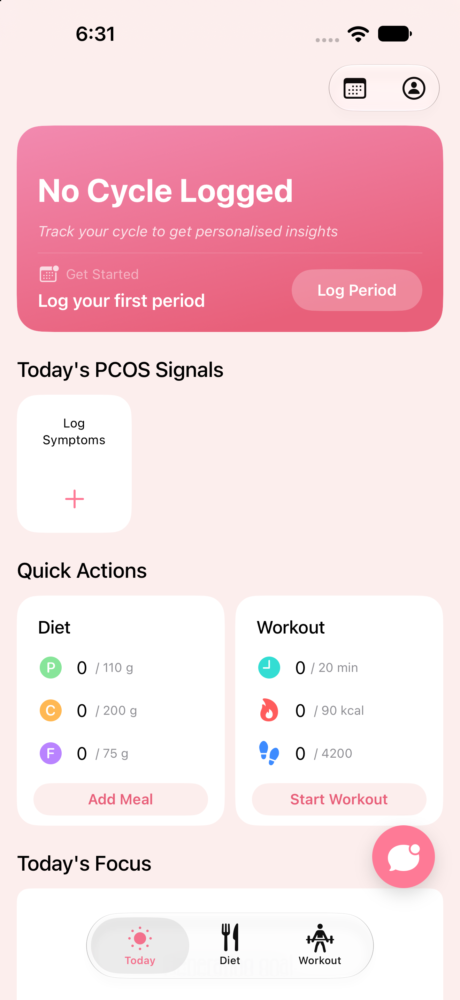
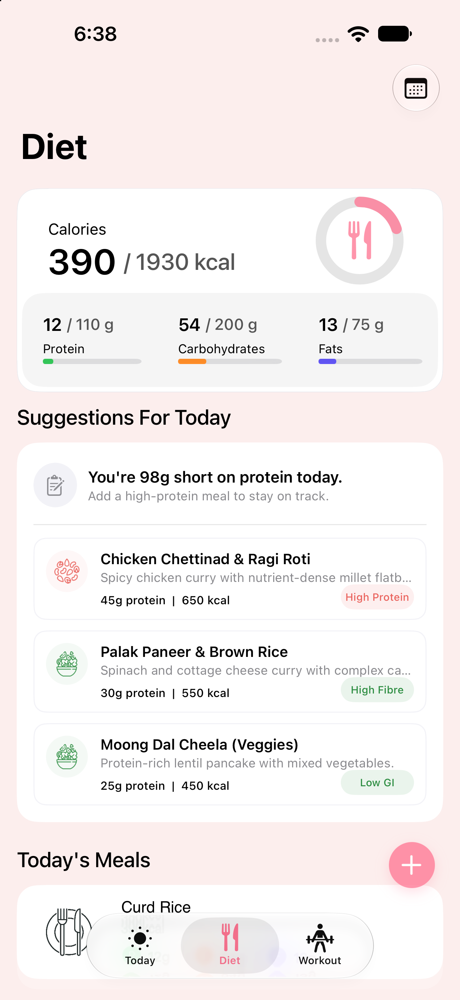
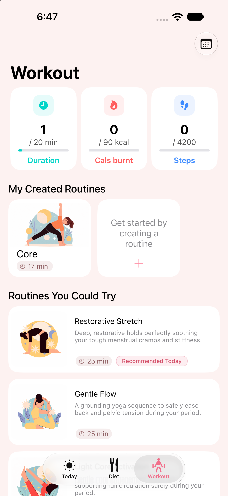

# Cyster - Your PCOS Companion

**An AI-powered health companion for women managing PCOS, built with Indian lifestyle in mind.**

1 in 5 women in India live with PCOS — nearly double the global average of 1 in 10 — 
and most are left to navigate it with scattered advice and generic period trackers. 
Cyster was built to change that.

     

&nbsp;
&nbsp;
&nbsp;
&nbsp;

---

## Why we built this

A 14 year old girl diagnosed with PCOS found only scattered forums and 
generic period-tracking apps — nothing that treated PCOS as the complex, 
phenotype-dependent condition it actually is. Cyster was built to be the resource 
that didn't exist then: research-grounded, personalized, and built specifically 
with Indian diets and lifestyle in mind, where PCOS prevalence is nearly double 
the global average.

---

## Features

### Today
Your daily health dashboard. Log symptoms, track your menstrual cycle, view your current cycle phase, and get AI-generated daily goals — all in one scrollable view.

### AI Health Coach
A conversational PCOS coach, Cyster, grounded in your actual cycle phase, sleep, nutrition, and symptom history rather than generic advice — tuned specifically for Indian diets and lifestyle. Every recommendation is grounded in structured user data and clinical research (Rotterdam criteria / ESHRE 2023), not open-ended generation, to keep guidance accurate and consistent.

### Diet
Log meals by searching, snapping a photo for AI-powered food recognition, or describing what you ate in plain language (e.g. "rice and one bowl curd") for instant macro calculation. Get AI-suggested PCOS-friendly meal ideas and track macros with visual charts.

### Workout
Browse PCOS-specific predefined routines or build your own. Routines and intensity are shaped by your PCOS phenotype — for example, capping duration for adrenal-dominant phenotypes to avoid cortisol spikes. Start a guided workout session with a built-in timer, rest intervals, pace selection, and a Live Activity on your Lock Screen.

### Sleep
Log your bedtime and wake time daily. View weekly sleep trends and quality scores synced with Apple Health.

### Reminders
Set custom push notification schedules for meals, workouts, and sleep wind-down — configurable to your routine.

### Insights
View cycle history, symptom trends across cycles, nutrition charts, and workout metrics over time.

### Onboarding
A one-time setup that captures your PCOS phenotype, diet preference, and activity level, feeding a personalized goal engine that calculates diet, workout, and sleep targets from day one — using the Mifflin-St Jeor formula adjusted for phenotype and activity level, not generic averages.

---

## Architecture

Cyster pairs a native iOS app with a cloud backend so AI capabilities can evolve 
independently of app releases:

- **iOS app** — Swift/UIKit with Core Data for local, offline-first storage and 
  HealthKit integration for live steps and sleep sync
- **Backend** — Python/FastAPI services deployed independently on Google Cloud Run
- **AI inference** — Google Vertex AI/Gemini powers the health coach, meal image 
  analysis, and natural-language meal parsing
- **Auth** — Firebase Authentication issues JWTs that gate every backend API call
- **Subscriptions** — RevenueCat manages entitlements, offerings, and in-app 
  purchase state
- **Infra** — Google Cloud Build, Artifact Registry, and Secret Manager handle 
  CI/CD, container management, and secure configuration

This split keeps sensitive health data synced reliably between device and cloud, 
while letting us iterate on prompts, models, and recommendation logic without 
requiring App Store releases. The architecture is designed to support Android and 
future RAG/vector-storage-backed personalization.

---

## Tech

**iOS:** Swift · UIKit · Core Data · HealthKit
**Backend:** Python · FastAPI · Google Cloud Run · Google Cloud Build · Artifact Registry · Secret Manager
**AI:** Google Vertex AI · Gemini
**Auth & Payments:** Firebase Authentication · RevenueCat

---

## License

This project is open-source under the [MIT License](LICENSE).

---

## Team

MIT-WPU Group 2 — iOS Development Project
Selected for the Apple & Infosys iOS Student Developer Program

- Abhinaya Rajarajan 
- Dnyaneshwari Gogawale 
- Pradeep Biswas 
- Sakshi Beloshe 
